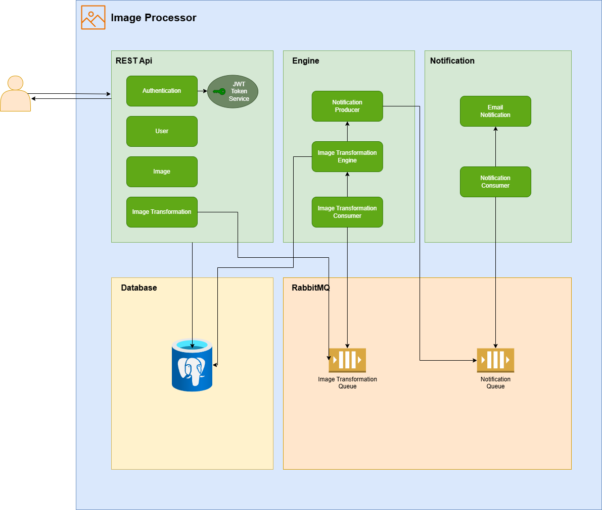
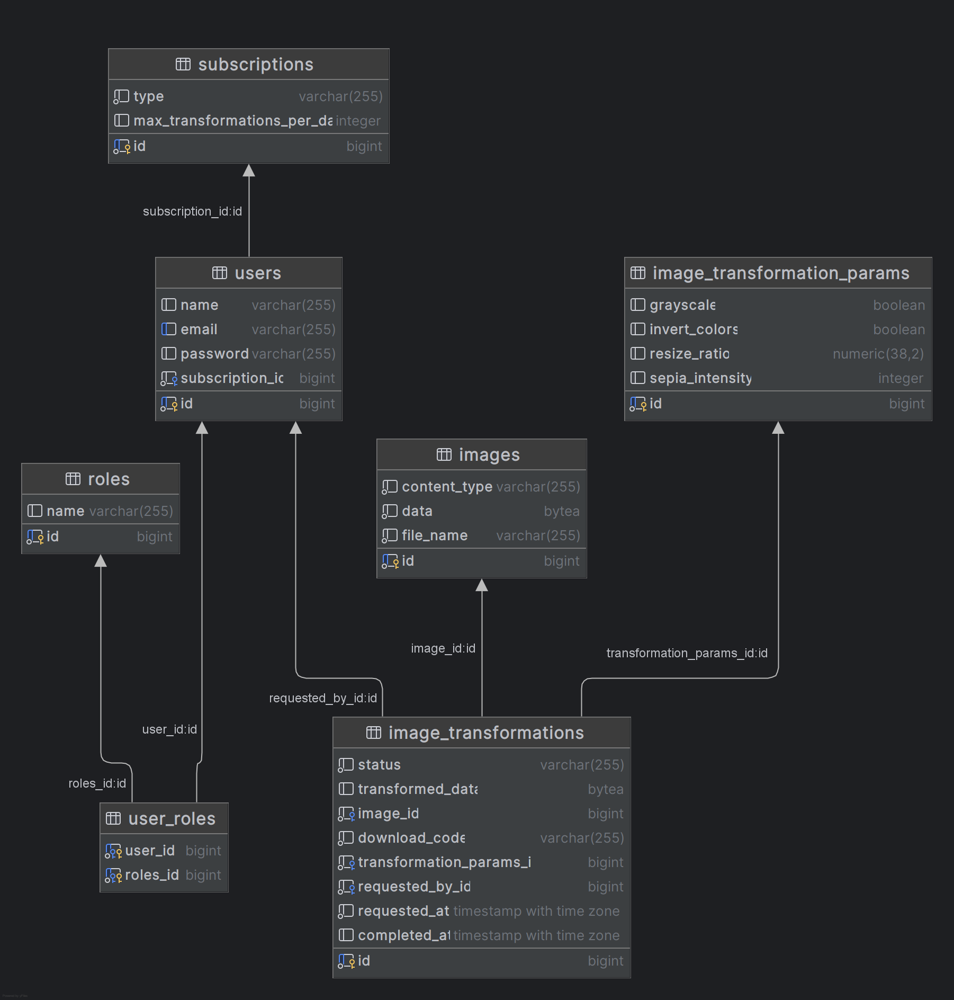

# Image Processor

## Overview

The Image Processor is a web application that allows users to perform image transformations through a REST Api.


## Key Features

- **Image Resizing**: Modify the dimensions of uploaded images
- **Image Filters**: Apply visual effects to images including:
    - Sepia tone
    - Inverted colors
    - Grayscale conversion

- **Asynchronous Processing**: Transformations are performed in the background
- **Email Notifications**: Users receive email notifications when their image transformations are complete
- **Download Links**: Transformed images are available for download via links provided in the notification emails

## Architecture



## Database Entities



## Getting Started

### Prerequisits

- Java 21
- Maven 3.x
- Docker

### Setting Up the Application

1. Clone the repository:
   ```bash
   git clone git@github.com:gustavofrancoporto/image-processor.git
   ```
2. Navigate to the project directory:
   ```bash
   cd image-processor
   ```
3. Build the application using Maven:
   ```bash
   mvn clean install
   ```
4. Start containers using docker
   ```bash
   docker compose -f .\docker\docker-compose.yml up -d
   ```
### Accessing the Application

1. Open a browser and access Swagger UI:
   ```
   http://localhost:8080/swagger-ui/index.html
   ```

2. Create a new user using the User POST endpoint

3. Retrieve an JWT Token using the Authentication endpoint and the email and password of the user created

4. Copy the token, click on Authorize, paste it into the text field and click on Authorize again

5. Request an image transformation using the Image Transform endpoint

6. The user should receive an e-mail with the result of the transformation.

